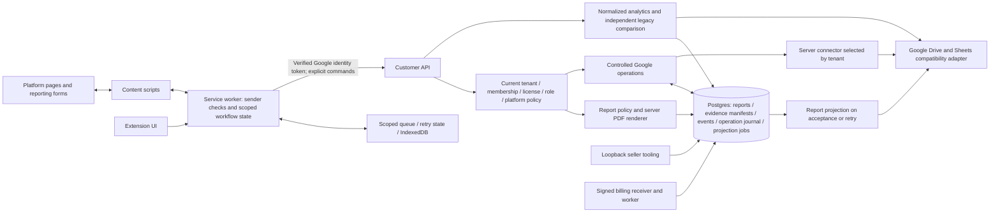
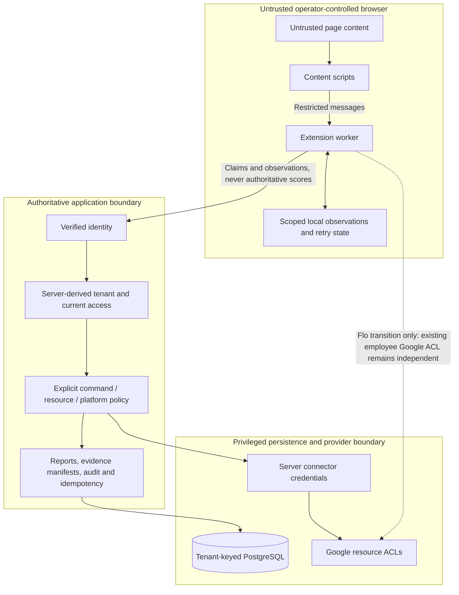

# Production-readiness implementation status

Updated 2026-09-22. This follows the [baseline audit](PRODUCTION_READINESS_AUDIT.md) and [future file map](FUTURE_FILE_MAP.md). The baseline describes the repository **before** these implementation changes. It remains the finding/acceptance-gate inventory, not a description of the new source.

**Status: implementation and isolated testing, not approved for commercial production.** No production database migration, API deployment, Google mutation, extension publication, ACL change, or billing configuration was performed. Existing deployed FloSports behavior is unchanged. Do not distribute this candidate until the compatibility gates below pass.

## Implemented in this working tree

- The extension's active Google helper surface now calls explicit commands on the existing authenticated customer-data API. The server chooses destinations, resolves current membership/license/feature permissions, checks platform assignments, and obtains a customer-specific connector token. No generic URL, SQL, Google method, destination override, or arbitrary provider request is exposed. Existing helper signatures remain for the Flo workflows.
- Empty analytics platform filters mean the current member's platform scope. URL matching uses hostname boundaries. Event, report, sheet-row and legacy-statistics access is platform scoped. Transactions refresh membership/platform access before admitting work.
- Database resource reservations reject configuring two customers with the same Drive root/workbook ID. Existing collisions abort migration instead of choosing an owner. Uploaded folders must descend from the configured root. Resource ancestry and Google ACL onboarding still need verification; unique IDs alone do not prove exclusive sharing.
- Google mutations have a request-hash/idempotency journal. Replayed completed requests return their stored result; changed payloads conflict; uncertain provider writes require reconciliation. The scanner's completion bonus is derived from stored row URLs and keyed to the row contents, not the supplied number of points.
- Generated PDFs retain their report inputs, policy snapshot and configuration version. Accepted reports require matching actor/event/report IDs, matching URLs and an uploaded PDF with the same SHA-256 digest as the generated bytes. Screenshots must be uploaded by that actor for that event. Duplicate work/target records cannot earn report credit through new report/event IDs. YouTube short/watch URL aliases share a duplicate key; complete canonicalization for every provider remains future work.
- The report ledger derives counts and base rewards on the server, records accepted and observed timestamps separately, and labels other events as operator observations without reward authority. A generated report is evidence preparation, not proof of a successful platform takedown. Unknown resolution/burndown statistics render as unavailable instead of zero.
- Server report policy checks the configured vertical, workbook event catalog, declared target handle, URL-embedded handles, and authorized-handle list. Required provider failures hold the operation. The server calculates Double XP from a stored expiry. This is **not yet sufficient verification of platform-account identity or of the owner of every video URL**.
- Accepted reports create a durable operational-sheet projection job. The server writes the existing A–U layout, leaves V available for resolution dates, and uses W (`Rights Reporter ID`) for reconciliation. It refuses an occupied W column or missing expected report tab. An uncertain append can only be reconciled by finding its ID; it cannot blindly append again. Completed projection jobs are not repeated.
- The extension persists per-group report IDs, evidence links, accepted-event inputs, timestamps and completion state across retries. Upload request IDs include the scoped content. This is a recovery foundation, not a complete background queue/reconciliation UI.
- `query_legacy_statistics` now reads the operational workbook independently. Comparisons require distinct source provenance and cannot certify equality by querying the normalized store twice. No live Flo parity has been claimed.
- Screenshots use customer/user keys and expire from reads after 24 hours. Capture checks the originating active tab before/after capture. Rogue network observation is limited to an explicit session/tab, bounded, and strips query strings/credentials/fragments. Scope changes stop the scanner, reset capture and clear local evidence. Late bootstrap responses cannot resurrect a logged-out profile. Runtime messages have sender/surface checks and unknown action policies deny by default.
- Event vocabulary lives in an environment-neutral contract module. Shared configuration edits validate server permissions, supported sections, selector paths, Double XP retention and level thresholds. Neutral builds strip nested Flo account allowlists as well as verticals.
- Migrations use a session advisory lock, SHA-256 ledger and atomic migration/ledger commits. Applied-file changes are rejected. Identity/provider/DB timeouts and bounded report/query sizes were added. CI requires a disposable PostgreSQL database; it cannot silently skip database tests. Release checks exclude secret/server paths and include the new shared contracts.

## Architecture after this implementation

## Finding status and remaining gates

“Implemented” below describes source/tests; it does not certify deployment controls.

| Priority / finding | Status | Remaining gate |
| --- | --- | --- |
| P0-01 operational authority | API migration implemented; rollout open | Configure server connectors; review inherited sharing; remove SaaS operators' direct Google write authority where SaaS revocation is promised. Transitional delegated tokens cannot satisfy that promise. |
| P0-02 platform scope | Implemented with unit and database tests | Smoke-test the deployed API with distinct platform assignments and a second customer. |
| P0-03 authoritative facts | Core report/evidence/duplicate/reward controls implemented | Finish domain transitions and provenance for all automation outcomes; approve reward migration semantics below; verify all provider URL canonicalizers. |
| P0-04 capture isolation | Core guards implemented | Real Chrome two-account/two-tab/service-worker-restart tests, including queue cancellation and in-flight scopes. Periodic physical removal of expired IndexedDB blobs remains separate from read expiry. |
| P0-05 enforcement safety | Fail-closed catalog/declared-handle checks implemented | Explicit scout/enforce permissions; server-owned platform-account assignment; trusted target-account resolution for opaque video IDs. Existing UI session checks remain advisory and the report-permission enforcer shortcut remains. |
| P0-06 projection and parity | Independent read and durable projection implemented | Test against a copied Flo workbook with approved sanitized baselines, reserve W, validate formulas/formatting, resolve discrepancies; add operator reconciliation tooling. |
| P0-07 unrelated-customer onboarding | Resource reservations and neutral account defaults implemented | Connector/resource/ACL verification, nested/shared-root collision checks, external OAuth consent/distribution tests and customer-specific account configuration. |
| P1-01 database defense in depth | Open | Separate migrator/runtime roles, grants/RLS and cross-tenant tests under the actual non-owner runtime role. |
| P1-02 workflow durability | Partial | Background worker, recovery/reconciliation UI, compensation and crash tests at every provider write boundary. |
| P1-03 analytics semantics | Partial | Unavailable metrics now explicit; settle scoring, timezone, resolution provenance and independent baselines. |
| P1-04 message boundary | Sender/default-deny guards implemented | Real extension regression tests across supported forms and embedded same-origin frames; finer per-message schemas. |
| P1-05 operational limits | Partial | Edge/per-actor rate limits, pagination, streamed response limits, telemetry and alerting. Existing mutation/report quotas do not replace these. |
| P1-06 release discipline | Migration ledger and required-DB CI implemented | Staging/production secret separation, protected branches, CI execution in hosted runner, backups/restore rehearsal and deployment rollback rehearsal. |
| P1-07 billing operations | Existing implementation preserved | Schedule/monitor billing worker and verify authoritative provider bridge/retries in deployment. |
| P1-08 report compatibility | Sentinel and batch-limit fixes implemented | Server logo resolution and visual PDF comparison; screenshot failures, long names and all platform batch boundaries. |
| P2-01 multi-membership / enterprise SSO | Open | Global principals plus explicit tenant selection if agency/SSO use is sold; do not change the one-tenant identity invariant casually. |
| P2-02 shared policy/contracts | Partial | Remove remaining duplicate rank/reward/platform and legacy membership policies after parity. |
| P2-03 hosted seller security | Open by design | Keep seller tooling loopback-only; hosted SSO/MFA/session/support model is separate work. |
| P2-04 retention/export | Evidence manifests/digests implemented; remainder open | Customer retention/legal-hold/export/deletion/restore contracts and tenant-scoped jobs. |
| P2-05 supply chain | Build/ignore improvements implemented; remainder open | Full secret/history scan, dependency/SBOM/license and asset audit, signing and reproducibility. |
| P3-01/P3-02 copy and scaffolding | Open | Neutral support identity/copy and retirement of unused legacy paths after regression checks. |

## FloSports compatibility limits to resolve before deployment

This branch changes authority and must be rolled out as a coordinated API/extension change. Existing local captures without a tenant/user tag cannot be reassigned safely; recapture them after upgrade. Existing report rows remain readable. Old generated reports without the new manifest/policy are not automatically promoted into authoritative events.

The new report scoring version uses 10 scout / 20 enforcer points per item, multiplied by an unexpired server-read Double XP rule. It intentionally does not trust browser streak/freezes, queue multipliers, arbitrary `scoutScore`, or whitelist penalties. Those legacy bonuses need a server-owned batch/streak ledger and approved parity fixtures **before this candidate replaces the Flo workflow**. Scanner completion bonuses are one award per resolved row's current contents, not repeated client claims of newly struck URLs; reconcile existing historical awards before enabling them. Do not represent this as full reward parity.

The Drive JSON and Sheets catalog are still a server-controlled **compatibility source**, not a normalized Postgres rights/configuration model. Workbook editor access can still change this source. The target design is to version customer rights, authorized accounts, selectors and reward policies in Postgres and project approved changes to Google only where needed.

## Migration and rollout order

1. Review the complete working-tree diff, including pre-existing licensing/team changes. Save sanitized Flo report, whitelist, Double XP, scoreboard and intelligence fixtures; test a neutral second customer. Resolve reward/account-policy gates above first.
2. Provision isolated staging Google workbooks/folders and server OAuth connectors with least access. Verify resource IDs, parent/shared-drive ACLs, duplicate/nested roots, tab names and W-column reservation. Never use production Google resources for fixture tests.
3. Run all migrations on an isolated database using `DATABASE_URL_UNPOOLED`; adopt the ledger only after reviewing existing migration contents. A duplicate destination aborts migration. A checksum mismatch requires an additive migration, not editing a ledger record. Preserve backups and rehearse restore before production.
4. Configure `GOOGLE_CONNECTORS_JSON` in server secrets, keyed by customer ID, with `clientId`, `clientSecret`, `refreshToken`. These values must never enter extension config/builds. Existing identity-client/origin settings still apply. The checked-in Neon definition forwards connector secrets only to the customer API functions.
5. For an explicitly limited Flo transition, `LEGACY_GOOGLE_USER_TOKEN_CUSTOMERS=flosports` allows the verified employee's token **through the same server command checks**. It does not revoke that employee's independent Google ACL. Leave this variable empty for customers sold SaaS-controlled access; remove it after connector/ACL cutover.
6. Deploy the API and migration-compatible server first in staging, then load the candidate extension there. Verify reports with/without screenshots, unavailable whitelist, expired licenses, disabled/platform-restricted members, retries, failed uploads, scanner rows and independent statistics. The local `.env.local` and `.neon` were not changed by this work.
7. Reconcile every uncertain operation before reissuing it. `integration_operations` stores identity, command name, request hash, status and result; an uncertain upload may exist in Google even if no manifest was committed. Use Google appProperties to locate the scoped file. For projections, search W for the report ID. If absent, establish that no delayed append remains before an administrator resets a job to pending; this is not an automatic retry instruction.
8. After the P0 gates pass, schedule a controlled Flo upgrade, monitor projection failures and license denial, and validate a second unrelated company. Keep the old deployment available during staging; do not downgrade a paying customer's controls to a direct-Google client as rollback. Avoid destructive schema rollback; the migrations are additive.
9. Complete P1 before broad rollout, then P2/P3. Add the durable worker and normalized policy/configuration store incrementally.

## Validation and test prerequisites

Executed on a schema-only Neon branch (`audit-security-20260922`, `br-frosty-river-aewly7ji`), created without copying production rows. Automatic expiry: 2026-09-23 23:00 UTC. Saved project context remains `production`; the test credential was used only from a private temporary file. No production connection or Google endpoint was used by the tests.

- Required-DB regression suite: **134 passed, 0 failed, 0 skipped** (2026-09-22, before the next reward-parity implementation stage). Covers provisioning/licensing/seat races, member lifecycle, platform revocation, destination collisions, invented reports, foreign evidence, PDF hashes, event replay conflicts, duplicate work, uncertain projections and operation journals.
- Unit suites cover spoofed hostnames, raw API platform filters, connector scoping, provider outage behavior, whitelist failure, capture-tab navigation, logout races, neutral allowlist removal, runtime sender restrictions and independent comparison provenance.
- Extension build checked in a temporary directory, with archive exclusions and all relative JavaScript imports verified. This is a test artifact, not a published release.
- Still required before major refactoring/release: copied-workbook end-to-end fixtures, visual PDF baselines, real Chrome account/tab/frame/restart tests, provider timeout-after-commit reconciliation, connector rotation/revocation tests, runtime-role isolation, backup/restore, worker scheduling and operational alert drills.

Run local unit/regression tests with `npm test`; this permits DB tests to skip if no test URL is supplied. Use `npm run test:ci` with `TEST_DATABASE_URL` and `TEST_DATABASE_ISOLATED=true` for the required database gate. Never point either test command at production. CI uses a disposable PostgreSQL service, with no production secrets.

## Files for the next implementation stage

The [full file map](FUTURE_FILE_MAP.md) remains applicable. Prioritize:

- `server/report_policy.js`, `server/postgres_repository.js`, `server/platform_policy.js`, new domain-policy migrations: platform-account authority, rights/versioning, canonical targets, reward/streak/batch ledger and tenant-isolated repositories.
- `server/integrations/google_operations.js`, `google_adapter.js`, `google_credentials.js`: verified connector onboarding, least-privilege resources, normalized configuration migration and complete reconciliation.
- `background/services/reporting_workflow.js`, `rogue_workflow.js`, `services/sheet_scanner.js`, `services/google_operation_service.js`: durable job UI, cancellation and restart tests.
- `sidepanel/main.js`, `utils/access_control.js`, `server/access_policy.js`: explicit report versus enforcement capability and customer platform-account assignment.
- `server/report_pdf.js`, `services/report_service.js`, `utils/pdf_gen.js`: approved branding and visual/report/statistics compatibility.
- `server/db.js`, `server/sql/`, `.github/workflows/test.yml`, `neon.ts`, deployment tooling: runtime grants/RLS, protected environments, scheduled workers, observability and restore tests.
- `tests/operations_postgres.test.mjs`, `tests/google_operations.test.mjs`, browser/provider fixture suites: preserve the trust-boundary tests before extracting or replacing the legacy adapter.
