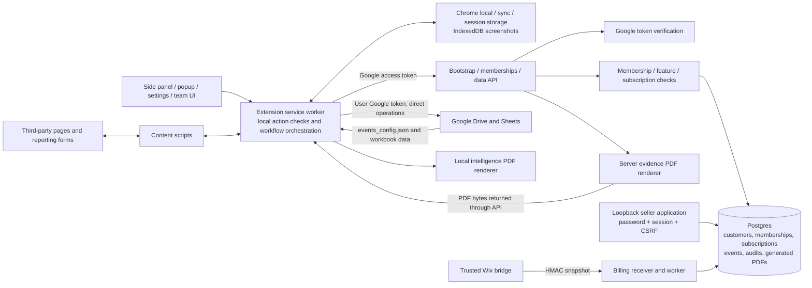
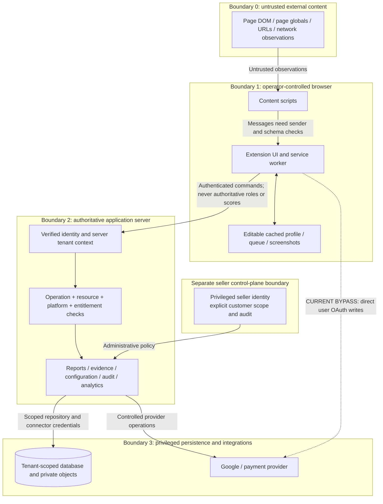
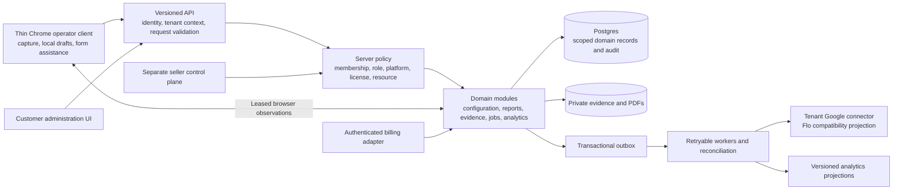

# Rights Reporter production-readiness architecture audit

Audit date: 2026-09-22. Baseline HEAD: `303d2dfd68192c6612f971aa412c12c15ef5f7c2`, **including the existing uncommitted working-tree changes**. This is a source architecture review, not a certification of a deployed environment.

> Subsequent implementation is tracked in [IMPLEMENTATION_STATUS.md](IMPLEMENTATION_STATUS.md). Findings and line references below describe the audited baseline.

## Decision

**Do not onboard a paying customer yet.** The repository has a useful server control plane, but operational authority remains split between it, mutable extension state, Google resource permissions, and Drive-hosted configuration. Complete the P0 gates below before commercial use. Preserve FloSports through an explicitly scoped compatibility adapter and independent regression fixtures; do not replace its workflows in one rewrite.

This audit changes documentation only. No runtime, configuration, database, deployment, subscription, or customer data was changed. The existing licensing/team work was preserved.

### Scope and confidence

- Inventoried 214 tracked/non-ignored untracked paths before adding these documents; scanned 178 readable text files for common credential patterns. Reviewed the active extension entry points, content scripts, workflow modules, service clients, HTTP handlers, repository queries, six SQL migrations, seller tooling, Wix bridge, packaging, configuration, tests, and existing architecture/migration documentation.
- Included current untracked licensing, PDF, team-management, build, and integration code. Historical snapshots, generated screenshots/browser traces, binary/media assets, and vendored jsPDF were inventoried; they were not treated as current application logic. The snapshot archive's 200 entry names were checked for environment/credential paths, without restoring it. This is not an exhaustive history, dependency, binary, or secret audit.
- No deployed endpoints, production database, Google ACLs, OAuth console, billing account, secrets, backups, or hosting settings were accessed. Those controls remain **unverified**, not presumed absent. Ignored private environment-file contents were not read or printed.
- Evidence references below use paths and line numbers from this working tree; line numbers will move. Distinguish **confirmed source behavior**, **conditional exposure**, and **deployment verification**.
- [Future file modifications](FUTURE_FILE_MAP.md) maps the roadmap to existing files and proposed modules.

## Current architecture

**Existing strengths to retain:** Google audience/verified-email/scope checks (`server/google_identity.js:15`); tenant derived from membership rather than a submitted customer ID; tenant predicates and composite foreign keys for events/reports; role/feature/subscription checks on API operations; transactional seat/final-admin enforcement; versioned team previews and idempotent commits; audited configuration/subscription changes; signed billing messages with freshness checks, deduplication and ordered processing; server-generated evidence PDFs; fixed profile schemas, short cache lifetimes, neutral theme fallback, scoped statistics caches, and an allowlisted extension build.

The backend already protects customer administration and evidence PDF generation. It would be inaccurate to describe all authorization as client-only, all PDFs as local, or the public API as unauthenticated.

## Trust boundaries

The extension service worker is more privileged than a content script, but both remain outside the SaaS trust boundary. CORS, extension IDs, hidden buttons, cached profiles, and PDF/Drive scope metadata are not authorization credentials. The diagrams do not imply that ordinary web pages can directly read extension memory. Content-script messages and page-derived values still require validation; see [Chrome's extension security guidance](https://developer.chrome.com/docs/extensions/develop/security-privacy/stay-secure).

## Prioritized findings and remediation gates

P0 = must fix before any paying customer. P1 = must fix before broader production rollout. P2 = product hardening. P3 = polish. Each item includes a completion gate so the plan can become implementation work without expanding into a rewrite.

### P0 — commercial blockers

| ID | Evidence and impact | Required remediation and acceptance gate |
| --- | --- | --- |
| P0-01 — Operational writes bypass SaaS authority | `utils/google_api.js:48,386,399,481,511,535,625,990,1010,1220`; `background/main.js:76,488`; `services/sheet_scanner.js:477,505`. Extension code uses a user's Google token to read/write operational sheets, upload evidence, and edit Drive JSON. SaaS role, suspension, and subscription enforcement cannot prevent equivalent direct Google requests while the user's Google ACL permits them. A structurally valid edited local profile can affect local gates, though it does **not** bypass backend membership checks. | Add operation-specific server APIs and a tenant-bound Google connector for workflows offered to paying customers. Server derives destinations, permissions, entitlement, and audit actor. Keep FloSports legacy support explicitly scoped during migration. Gate: disabled/unlicensed users cannot cause new application-managed writes via any supported path, and connector credentials/resources cannot be selected arbitrarily by clients. Existing human access to customer-owned Drive remains governed by Google ACLs and must not be represented as SaaS-revocable. |
| P0-02 — Member platform restrictions are not enforced by the data API | `server/customer_api_service.js:154,272`; `server/postgres_repository.js:82,331,352`. Bootstrap intersects member `platforms` with customer platforms, but `resolveInside()` does not carry member platforms into the server actor. Events validate only the customer platform list, only when `attributes.platform` is present; statistics accept any customer-enabled platforms and an empty filter returns all. Report generation accepts arbitrary HTTP(S) item URLs with no platform policy. | Compute effective member platforms on the server and enforce them for every event, report item, query and job. Derive/validate platforms from canonical URL hostnames; require fields by operation; define separately whether a role can view organization-wide analytics. Gate: a YouTube-only operator cannot write/report/query another assigned-to-someone-else platform through raw API calls, omitted fields, empty lists, or mixed batches. |
| P0-03 — Claimed events are treated as business facts | `background/services/reporting_workflow.js:598–657`; `server/customer_api_service.js:84–108,200–218`; `server/postgres_repository.js:139,331`. Clients choose points, counts, timestamps, outcome text, report IDs and evidence URLs. Event attribute allowlists are not required-field or transition validation. New event IDs allow repeated credit for the same alleged work. A caller with report permission can submit very large scores without URLs or a corresponding report. PDF creation does not bind evidence/event IDs to stored tenant resources. | Separate observations from authoritative domain commands. Persist reports/evidence and validate ownership, authorized source work, policy version, operation prerequisites and state transitions. Calculate rewards/counts on the server. Store client-observed and server-accepted times separately. Gate: forged points, nonexistent reports/evidence, mismatched counts, repeated outcomes, and illegal transitions cannot affect authoritative audit or analytics. Third-party submission success must be identified as operator-reported until there is independently verifiable acknowledgement. |
| P0-04 — Sensitive capture and local state can cross contexts | `background/services/rogue_workflow.js:10–45` records matching network URLs from **all tabs** into one in-memory map, including before a particular capture; no tab/customer filtering or URL-query redaction. It survives customer changes until capture or worker restart. `reporting_workflow.js:358–361` ignores the sender tab and captures the currently visible tab. `services/customer_bootstrap_service.js:16–28,216,376` clears a subset of keys; `utils/idb_storage.js:3–39` stores screenshots only by ID, without tenant/user ownership. | Bind captures, queues, timers, in-flight work and blobs to tenant + user + source tab + operation; check active tab before capture; collect network evidence only during the selected capture; bound and redact it. Cancel old operations and purge/partition evidence on logout/account change. Gate: a two-account/two-tab test cannot show or upload old/customer-unrelated screenshots, signed media URLs, or observations under the new scope. Current rogue API sends observation counts, not the entire network URL list; the raw list is nevertheless exposed in browser state/UI. |
| P0-05 — Enforcement safety checks are advisory and fail open | `utils/google_api.js:348–382` returns false when the whitelist lookup fails, making unavailable protection indistinguishable from an unlisted target; `reporting_workflow.js:363–385` also proceeds after whitelist errors. `sidepanel/main.js:368` returns true for enforcer mode on basic report permission, before the platform-account checks. The fallback references undefined `approvedHandles` at line 325. Server report generation does not check authorized handles/source rights. | Define scout/enforce permissions and customer policy explicitly. Server must authorize the target/work/platform/account assignment and whitelist result before an enforcement command. Unavailable required policy should hold the action for retry/review. Keep page session inspection as an operator aid, not proof of authority. Gate: whitelisted targets, unavailable whitelist, wrong platform account and report-only actors cannot produce an authorized enforcement action. |
| P0-06 — Independent migration proof and operational projection are missing | `server/postgres_repository.js:352–389` reads the same `customer_events` for normal and `query_legacy_statistics`; the latter merely adds `dataScope`. `services/customer_migration_service.js:145` compares these responses, not legacy Sheets. The extra field may itself force a mismatch. `recordEvent()` only inserts into Postgres; no Sheets projector/outbox exists in `server/`. The active batch flow no longer invokes retained `appendToSheet()`, while the Closer still reads the operational report sheet. Docs claiming a server projector or independent legacy adapter describe intended behavior, not this implementation. | Capture approved, sanitized FloSports baselines; implement an independent read-only legacy adapter/fixture comparison and an idempotent operational sheet projection if that sheet remains required. Gate: new reports appear once in the expected operational workflow, the Closer can find them, and reconciliation matches independently calculated source results. Do not remove legacy capabilities based on the current parity flag. |
| P0-07 — Integration ownership and distribution are not tenant-neutral enough | `utils/customer_config.js` validates destination ID syntax, while `server/customer_provisioning.js:149` and `server/customer_management.js:196` do not verify connector access, ownership, cross-tenant destination reuse, or inherited sharing. `events_config.json:16–80` contains Flo verticals and specific YouTube channel/Studio manager allowlists. `scripts/build_extension.mjs:46` clears verticals but retains nested session IDs. `manifest.json:45–51` requests broad Drive/Sheets access for one configured OAuth client. | Establish a tenant resource registry and verified connector onboarding; reject accidental reuse across unrelated customers and check parent/shared-drive/ACL scope. Move organization account allowlists to server customer configuration; ship neutral defaults. Verify external-customer OAuth/distribution readiness and permissions in the actual release artifact. Gate: two unrelated customers onboard without Flo account IDs, shared destinations or developer-local setup assumptions; release contents and approved OAuth behavior are tested. Google resource IDs and OAuth client IDs are identifiers, not secrets, but accidental reuse is still a commercial isolation problem. |

### P1 — broader rollout gates

| ID | Evidence and impact | Required remediation and acceptance gate |
| --- | --- | --- |
| P1-01 — No database-enforced tenant boundary or audit immutability in migrations | `server/sql/001_customer_api.sql` through `006_team_management.sql` define useful scope keys but no RLS policies, application-role grants, or append-only protections. `server/db.js:8` uses one runtime connection credential; seller and worker modules use broad repositories. Audit actor/target columns do not all have composite membership foreign keys. Actual deployed privileges are unknown. | Establish least-privilege runtime, worker, migration and seller roles. Add transaction-scoped tenant context and tested RLS where appropriate, plus append-only audit permissions and scoped constraints. Use an explicit privileged path for identity lookup/seller/billing. Gate: the actual runtime DB role cannot read/write another tenant even when a query omits its tenant predicate; pooled connections cannot retain previous scope. A shared schema is viable with these controls. |
| P1-02 — Workflows are not durable or end-to-end idempotent | `reporting_workflow.js:484–669` uploads images, renders/uploads PDFs, emits multiple events, then clears the queue. A failure halfway through leaves external artifacts; retries generate new IDs. `sheet_scanner.js` runs tabs/timers in an ephemeral MV3 worker and combines events with separate Google mutations. Event/PDF idempotency protects only individual calls when the same ID is reused. | Create durable operation IDs, state machines, outbox/jobs, retries and reconciliation. Retain browser-side tab interaction as leased work, with resumable status. Gate: terminate the worker or fail every I/O boundary; replay results in one logical report/projection and recoverable evidence, with no lost queue or duplicate credit. |
| P1-03 — Analytics currently misrepresent supported metrics | `server/postgres_repository.js:143,196–223,365` hardcodes rank thresholds, uses UTC months and returns zero resolution/burndown metrics; `utils/google_api.js:89` uses Chicago months, `utils/gamification_levels.js` supports configurable levels, and legacy aggregators use different formulas. UI vertical filtering is not part of the API intelligence query. | Define versioned metric semantics, tenant timezone, denominators, source provenance and completeness. Project accepted report/outcome events into scoped aggregates; return unavailable metrics as unavailable. Gate: golden data covers month/DST boundaries, resolutions/retractions, duplicate attempts, configured levels and selected verticals. Do not sell placeholder resolution metrics as measured results. |
| P1-04 — Broad browser privilege and inconsistent sender validation | `manifest.json:23–51` includes all-URL access, webRequest and broad Google scopes; content scripts run in all matching frames. `background/main.js:216,965` has no default-deny requirement that every action have a policy and no general sender/frame/origin contract; Team routes correctly have an explicit sender restriction. `utils/platform_catalog.js:1–3` matches URL substrings, so `https://example.test/?next=youtube.com` is classified as YouTube. HTML-string sinks exist across content scripts/UI. | Build an explicit per-action sender/schema/permission registry; restrict privileged actions to trusted extension pages and designated top-level platform documents. Use hostname parsing and reviewed optional host permissions. Render untrusted strings with DOM text APIs. Gate: hostile URLs, iframe messages and page strings cannot trigger unrelated captures, navigation or privileged writes. These are attack surfaces; this review did not demonstrate a remote-code-execution exploit. |
| P1-05 — Availability and cost controls are incomplete | `server/http.js:37` limits bodies; report generation has a daily tenant quota and team preview has a per-actor quota. Other events/bootstrap/query calls have no application-wide rate limits. Token verification lacks timeout/circuit handling. Statistics load every matching event into JS without a maximum date window; all membership resolution locks customer rows. PDF rendering occurs while holding a serializable transaction and stores up to 4 MB per PDF in Postgres. | Add edge and tenant/actor budgets, DB/fetch/request deadlines, paginated or projected analytics, bounded jobs/storage retention and observability. Move heavy rendering outside the authorization transaction with version rechecks at commit; store PDFs privately behind authorized downloads. Gate: concurrency/load tests demonstrate bounded cost, isolation of a noisy tenant and timely membership/subscription changes. |
| P1-06 — Deployment and recovery are not reproducible from this repo | `config/customer_bootstrap.json` embeds branch-specific Neon compute URLs; `neon.ts` and `vercel.json` coexist, but wrappers use a `fetch` export and no dual-host smoke test is supplied. `scripts/configure_customer_api.mjs` derives path-based endpoints, unlike the current per-function hosts. `.env.example` includes Flo-specific sample identity/build values. `server/scripts/migrate.mjs` reruns every SQL file without a migration ledger/checksum/advisory lock. No tracked CI workflow is present. | Choose/document the supported deployment path; separate dev/staging/prod endpoint/OAuth/build profiles and secrets; add environment validation, migration tracking and expand/contract releases. Gate: an isolated clean deployment, old-extension compatibility test, upgrade, backup restore and rollback rehearsal pass. Assign explicit Flo subscription terms before enabling enforcement: migration 004 intentionally grants none. No deployment should infer credentials or endpoints from a developer's local configuration. |
| P1-07 — Billing delivery is implemented but operations are not proven | `integrations/wix/billing_bridge.mjs` depends on injected authoritative `getOrder`; `billing_service.js` persists retries/failures, but the repository does not configure a worker schedule, reconciliation schedule, alerts or failed-event recovery ownership. `/billing/process` is a global static bearer-secret endpoint. | Verify provider settlement/refund/cancel semantics in a sandbox; run authenticated scheduled processing/reconciliation; alert on delayed/failed events and expiring entitlement mismatches. Rotate receiver/worker secrets separately and restrict worker reachability/identity. Gate: duplicates, out-of-order cycles, delayed future changes, signature rotation and worker outages recover without incorrect grants. Do not call the HMAC bridge a native verified Wix JWT webhook. |
| P1-08 — Report contract regression with missing screenshots | `reporting_workflow.js:536` sends `No Screenshot Available`; `services/report_service.js:16` forwards it; `customer_api_service.js:285–290` rejects it as an invalid URL. Reports with disabled/missing/failed screenshot uploads can fail before completion. The API allows 500 PDF items, but report event URLs are capped at 100. Server PDF theme context supplies colors/legal/product but no resolved logo bytes, while the renderer expects `logoDataUrl`. | Normalize optional evidence with a shared contract, align batch limits, and safely resolve versioned branding on the server. Gate: existing Flo reports with/without screenshots, upload errors, logos, long names and boundary-size batches all complete with expected output. Treat this as a compatibility prerequisite for any rollout touching reports. |

### P2 — product hardening

| ID | Evidence and impact | Required remediation and acceptance gate |
| --- | --- | --- |
| P2-01 — Identity model limits unrelated-company and agency use | Global email uniqueness in migration 002 and subject uniqueness in 001, plus exactly-one-membership resolution, intentionally prevent an operator from belonging to two customers; disabled memberships also reserve the email. Only Google sign-in exists. | If agency/multi-company operators or enterprise SSO are in scope, introduce a global principal plus tenant memberships and an explicitly selected, server-validated tenant context. Plan email-change/offboarding recovery. Retain exactly-one behavior until tested. These are product limitations, not an existing cross-tenant bypass. |
| P2-02 — Split schemas and policy implementations will drift | Client and server event validators; bootstrap and resolve authorization; legacy membership mutations and new Team policy; rank/view/XP formulas; Drive config and DB customer config; multiple platform maps. Server imports contracts from browser service modules. | Extract environment-neutral versioned contracts, keep decisive policy in server domain services, and make browser checks advisory. Deprecate duplicate mutation paths only after callers migrate. Gate: contract compatibility tests and one authoritative policy implementation per operation. |
| P2-03 — Seller operations need a scalable privilege model | `server/seller_auth.js:31` is deliberately loopback-only, with hashed passwords, CSRF, throttling and expiring in-memory sessions. It is **not an unauthenticated public admin API**. Provisioning/update functions trust the caller-provided operator because the CLI/local authenticated shell is the privileged boundary. | Before hosting remotely, add seller SSO/MFA, named roles, explicit tenant scope, durable sessions/revocation, audited support actions and approvals for high-impact changes. Keep the current tool loopback-only until then. Never expose the raw provisioning functions as customer endpoints. |
| P2-04 — Retention, export and evidence provenance need product contracts | Events/audits store names, email, targets and notes; reports store PDF bytes; no cleanup policy for reports or expired team reviews is implemented. Evidence bytes are uploaded without a server-owned manifest/digest/retention record. Historical migration memberships, binary snapshots and browser traces contain customer context. | Define retention/deletion/export rules with customers, legal-hold handling, access-controlled evidence manifests, redacted logs and support access. Cleanly separate deployable app, protected migration data and support artifacts. Gate: tenant-scoped export/deletion/restore tests and evidence hash verification; preserve audit integrity during approved deletion. |
| P2-05 — Release and dependency assurance need broader coverage | Allowlisted build excludes server/env/migrations, but regex scanning covers only a few secret forms. Vendored `lib/jspdf.umd.min.js` is outside normal package dependency inventory; brand media remains broadly copied. Root `.gitignore` ignores `.env`/`.env.local`, not all secret-environment naming variants. | Scan release contents and history with an appropriate secret scanner, inventory/license vendored code/assets, pin supported runtimes and document build provenance/signing. Gate: clean release manifest/SBOM, approved assets, dependency checks and reproducible build verification. No specific dependency vulnerability was established by this review. |

### P3 — polish

| ID | Evidence and impact | Required remediation and acceptance gate |
| --- | --- | --- |
| P3-01 — Customer-facing copy still assumes a sports/single-seller product | `utils/extension_constants.js` has sports language; `options/team.html`, `options/team.js`, membership/team service messages say “Contact Ivan.” Flo/pirate media and legacy names remain. | Customer-configurable support identity and industry-neutral wording, with Flo branding retained only for Flo. Gate: neutral customer walkthrough and accessibility review. |
| P3-02 — Legacy scaffolding and documentation obscure the active architecture | Empty `services/scraper_engine_*.js`, `services/bot_engine.js`, `utils/ui_overlays.js`; comment-only `utils/config_manager.js`; duplicate `Copy of events_config.json`; retained `intel_math.js` and dormant Google helpers; outdated docs describe implemented projections/legacy adapters. | Mark/deprecate or remove unused paths after import/behavior checks; refresh diagrams and ownership docs during each migration stage. Keep historical snapshots clearly labeled and out of release artifacts. Gate: new contributors can trace one supported path per feature. |

## Browser exposure and isolation inventory

| Value/data | Present location | Classification and handling |
| --- | --- | --- |
| Google OAuth access token | `utils/auth.js`, Google helper calls, bootstrap/data/membership/report clients | Real runtime bearer credential with Drive/Sheets scopes. Needed for current legacy flow but too powerful as the long-term SaaS identity/connector model. Separate sign-in from tenant connector grants; keep durable provider credentials server-side. No hardcoded access token was found in the scanned source. |
| OAuth client ID, extension manifest public key, extension ID, API URLs | `manifest.json`, `.env.example`, `config/customer_bootstrap.json` | Public identifiers, **not client secrets/private keys**. Do not rotate merely because they are visible. Validate deployment/environment pairing. Claimed extension ID is spoofable and is not device attestation. |
| Roles, permissions, destinations, legal identity, contact data | Cached bootstrap profile, Chrome storage, runtime messages | Client-readable context, not a signed authorization grant. Server rechecks must remain decisive; expose only what each surface needs. There is no `chrome.storage.*.setAccessLevel` restriction in the current source. |
| Authorized platform handles/channel IDs/Studio IDs | Packaged and Drive `events_config.json` | Customer configuration visible in the distributed package. Not passwords, but leaks organization-specific assumptions and can authorize the wrong account in client logic. Move to tenant configuration; sanitize release defaults. |
| Screenshots, queue, reporter context, observed network URLs | IndexedDB; local/session/sync keys; rogue in-memory map | Sensitive operator/customer evidence, potentially including unrelated browsing/signed URLs. Partition, minimize, redact, expire and clear on scope change; never sync credentials. |
| DB connection credentials, seller password hash, billing secrets | Environment variables and `server/local_credentials.js` local settings path | Server-only configuration by design. The reviewed builder excludes these paths. Actual values and deployment storage were not inspected. Extend scans rather than claiming no possible leak exists. |

The credential-pattern scan found only database-URL placeholders/documentation, not a hardcoded DB password, private key, Google API key, GitHub token or Stripe secret in the scanned files. This is bounded evidence, not proof that every credential format or git-history exposure is absent.

Google's full `drive` scope is restricted; external distribution/verification requirements must be assessed for the real deployment. Evaluate narrower per-file grants where the workflow permits them, rather than assuming they can replace existing shared Drive behavior unchanged. [Google Drive scope documentation](https://developers.google.com/workspace/drive/api/guides/api-specific-auth).

## Direct Google operations: active versus retained

| Operation | Current source/caller | Target ownership |
| --- | --- | --- |
| Read event catalog and handle whitelist; add/update source-event URLs | `google_api.js::getEventData/checkIfAuthorized/addNewEventToSheet/updateEventUrl`; search/report workflows | Tenant configuration/source-work API and connector adapter; authorization and policy result recorded server-side. |
| Fetch/edit Drive `events_config.json`, selectors, scoring/retention settings | `fetchConfig/patchConfigSelector/updateConfigSections`; background settings/repair/alarm paths | Versioned configuration API with separate customer policy and reusable platform selectors; audited edits. |
| Find/create report/screenshot folders and upload files | `ensure*Folder/uploadToDrive`; reporting/rogue/intelligence paths | Tenant evidence/report service; server chooses destination and verifies ownership. |
| Read operational rows and modify status/rich-text/bonus cells | `getColumnHDataWithFormatting/updateRowStatus/updateCellWithRichText/addEnforcerBonusPoints`; scanner | Server-owned operation state and idempotent Sheets projection. Browser supplies observations only. |
| Submit feedback | `submitSuggestionToSheet`; background `submitSuggestion` | Authenticated tenant feedback API with safe literal text and destination mapping. |
| Legacy report append, rogue sheet write, local leaderboard/intelligence functions | Retained exports in `google_api.js`; active reporting/rogue/statistics routes now use the customer API | Explicit compatibility adapter if required. Do not count these exports as active writers without a caller. |
| Rights PDF filename search | `google_api.js::fetchRightsPdf` at line 862; **no current caller found** | Latent isolation hazard: unscoped whole-accessible-Drive filename query and first result. Before reuse, replace with a tenant-owned rights-document ID lookup; escape query literals and verify parent/resource ownership. |

Drive `appProperties` and PDF scope metadata are useful labels, not ACLs. The current code does not make uploads public automatically; inherited Google sharing is unknown. Destination syntax validation cannot prove isolation. Some legacy Google writes use `USER_ENTERED` and client-derived strings; controlled adapters must use literal-safe writes and reject formula/range injection. `addNewEventToSheet()` also uses read-last-row then PUT, which can overwrite concurrent additions.

## Recommended target architecture

Use a **modular backend with one authoritative domain model**, retaining the existing Postgres and API foundation. Do not introduce microservices merely to create boundaries.

Proposed responsibilities:

1. **Identity and tenant context:** verify identity, resolve principal and active membership, then create request-local tenant context. Start with the current Google verifier and strengthen timeouts/negative tests. Introduce short-lived app sessions/token exchange if needed; do not invent custom cryptography. The client never grants itself a tenant, role, paid feature or resource.
2. **Policy:** one server decision combining customer active status, subscription period/service state, seat policy, membership status/role, enabled features, member platforms and object ownership. A UI profile describes capabilities for usability only. Freeze rules/config versions for auditable actions and recheck authorization before new effects.
3. **Customer configuration:** distinguish public branding/legal form data, protected business rules (rights catalog, authorized accounts/handles, scoring), reusable platform-selector definitions and server-only connector credentials. Promote versioned approved configuration; remove the second authority in arbitrary Drive JSON gradually.
4. **Reports and evidence:** persist server IDs, tenant-owned source works, evidence manifests/digests, report revisions, operation status and submission acknowledgements. Use private objects or controlled tenant Drive resources, narrowly authorized uploads/downloads, quotas and retention. An uploaded file or page observation is not proof that a copyright claim was submitted successfully.
5. **Jobs/integrations:** transactional outbox for external writes; stable idempotency keys, tenant-aware retries, dead-letter handling, reconciliation and provider credential rotation. Retain browser automation where a human platform session is necessary, with leased tasks and explicit observation status. Do not automatically move arbitrary URL fetching to the server without SSRF/redirect/private-network defenses.
6. **Audit and analytics:** server-authored state-transition audit in the same transaction; preserve untrusted observations separately. Scope all reads and exports, define aggregation versions, and recompute projections from durable accepted facts. Operational Sheets become projections, not the authorization database.
7. **Seller/billing:** separate privileged policy/credentials from customer administration. Keep existing HMAC verification and transactional entitlement updates, then add operational scheduling and recovery. Customers cannot change purchased capacity through branding/config endpoints.

Adopt authorization at each operation/resource boundary as recommended by [OWASP Authorization](https://cheatsheetseries.owasp.org/cheatsheets/Authorization_Cheat_Sheet.html) and explicit tenant context/isolation tests from [OWASP Multi-Tenant Security](https://cheatsheetseries.owasp.org/cheatsheets/Multi_Tenant_Security_Cheat_Sheet.html). PostgreSQL RLS can add a second boundary, but table owners and bypass roles require special care; test the real runtime role, not an owner connection. [PostgreSQL row security](https://www.postgresql.org/docs/17/ddl-rowsecurity.html).

## Migration order and FloSports preservation

| Stage | Work and dependencies | Exit/rollback gate |
| --- | --- | --- |
| 0 — Baseline | Commit/review the existing working state separately from this audit; capture sanitized Flo reports, configuration, sheet layouts and analytics fixtures. Document current deployment and restore path. Add the tests below before moving modules. | Baseline tests and independent expected results exist. No production writes during audit/test setup. |
| 1 — Contain P0 risks | Fix member-platform API enforcement, required event fields, capture isolation, optional screenshot contract, whitelist failure handling and tenant-neutral release defaults. Establish resource ownership registry and release/OAuth verification. | Negative API and two-tenant browser tests pass; existing Flo report paths still work. |
| 2 — Establish server command authority | Add domain report/evidence/config commands and authoritative scoring/state transitions beside existing APIs. Introduce stable operation IDs and server audit. Scope compatibility flags to Flo on the server; no client-controlled fallback or paid-customer bypass. | New paths shadow read-only comparisons; no dual execution of takedowns/uploads. Roll back routing for the affected cohort using retained versions, without undoing successful external actions or reopening authorization gaps. |
| 3 — Move Google writes behind adapters | Establish tenant connector grants, controlled uploads and operational outbox projection. Migrate event/whitelist config, then source-event updates, report/evidence writes and scanner mutations. Keep exact Flo tab/column/format requirements as adapter tests. | Retry/reconciliation tests pass and every active operational sheet dependency is fed. Reconcile partial writes before switching traffic. |
| 4 — Prove migration and onboard | Compare API outputs against an independent legacy snapshot/adapter, reconcile backfilled historical data and cutover watermarks, verify explicit Flo license terms, then canary Flo. Onboard an unrelated synthetic tenant followed by a real customer only after **all P0 gates** pass. | Independent report/analytics totals, branding, legal fields and provider ACLs match expectations. Existing claims/evidence remain reachable; no historical double counting. |
| 5 — Scale the rollout | Complete remaining P1: database privileges/RLS, durable jobs, metrics, capacity limits, deployment CI, backups and billing operations. Remove extension provider write scopes only after compatibility traffic no longer needs them. | Recovery/load/security gates pass in staging and canary. Keep backward-compatible APIs until supported older extension versions have migrated. |
| 6 — Product expansion | P2 identities/SSO where required, unified contracts, seller platform, retention/export and dependency controls; then P3 cleanup. | Each expansion has scoped tests and product acceptance. |

No big-bang schema rewrite, forced credential migration, deployment, seed, or legacy deletion is authorized by this audit. Rollback means controlled routing/reconciliation and backward-compatible schema evolution, not restoring an old database over new customer activity.

## Tests required before major refactoring

Existing suites are useful foundations, particularly `customer_api_server`, `google_identity`, `customer_bootstrap`, `customer_data`, `customer_membership`, `customer_config`, provisioning/management/setup, seller auth, subscription, team, theme, and migration tests. Extend them; do not replace them with implementation-mirroring mocks.

| Test family | Required behavior and why it matters | Starting location / proposed suite |
| --- | --- | --- |
| Identity and raw HTTP contract | Missing/malformed/expired/wrong-audience token, unverified email, missing subject/scope, provider timeout/unavailability; method/content-type/body bounds; CORS does not replace identity; unknown operations fail closed. | `tests/google_identity.test.mjs`, `customer_api_server.test.mjs`; add actual handler/transport tests. |
| Tenant × role × platform × license matrix | Two tenants with overlapping names/URLs; outsider, employee, manager, admin; revoked/expired/suspended/over-cap states; forged IDs and cached admin profile; empty/mixed platform filters; arbitrary evidence/report/member IDs. Assert denied operations have no side effects. | Extend API tests and real repository tests; proposed `authorization_matrix.test.mjs`. |
| Real database isolation/concurrency | Use actual least-privilege runtime role; tenant predicates/RLS, pooled-context reset, rollback, simultaneous approvals/renewals/demotion, last-admin protection, idempotent report/event/billing replay and conflict detection. | Existing `subscription_postgres.test.mjs`, `team_postgres.test.mjs`; add tenant/evidence/config coverage. These must run as required CI gates on an explicitly isolated database. |
| Flo workflow characterization | Each currently supported platform: capture → source-work selection → whitelist → group/batch → PDF → evidence upload → event → operational sheet/Closer. Scout/enforce, Twitch Live/VOD, YouTube batching, no-screenshot mode and failed uploads; verify legal identity and branding. | Proposed fixture-backed `reporting_workflow` and `scanner_workflow` suites plus staged extension browser tests. Never submit live takedowns in automated tests. |
| Browser scope lifecycle | Account change/logout while upload/scan/bootstrap is pending, service-worker restart, two windows/iframes, wrong active tab, network observations from another tenant/tab, old IndexedDB IDs, changed managed destinations and stale timers. | Extend bootstrap tests; proposed browser capture/isolation suite. |
| Hostile content and safe adapters | `youtube.com.evil.test`, query-string domain spoofing, formula-like event/feedback text, malformed ranges/Drive query literals, HTML strings, redirects, oversized images, non-owned evidence and reused folder IDs. | Platform tests, operation validation tests, connector tests. Add SSRF cases when server fetching is introduced. |
| Authoritative state and scoring | Forged points/counts/times, duplicate reports under new event IDs, legal/illegal transitions, unsupported outcomes, whitelist unavailable, missing rights assignment; client estimates never become billed/audited facts directly. | Proposed server domain/policy tests. |
| Analytics parity | Independent frozen workbook input and expected outputs; no normal-vs-compatibility query self-comparison. Timezone/month/DST, configurable levels, zero data, retractions, resolved status, weighted metrics, vertical filters and historical import watermarks. | Extend migration tests; add golden metrics fixtures. |
| Failure recovery | Fail after each upload/render/event/projection step, terminate browser/worker, retry/replay, quota exhaustion, expired authorization during work, external 429/5xx and partial success. | Proposed outbox/report-job/connector integration suites. |
| Billing operations | Real provider-shape sandbox fixtures, HMAC freshness/rotation, refund and payment proof, same-ID/different-payload, ordering, future cycles, suspended customers, unmapped orders, failed-job recovery and reconciliation. | Existing `subscription.test.mjs`, `subscription_postgres.test.mjs`; add scheduled-worker and bridge contract tests. |
| Artifact and deployment | Inspect generated ZIP for secrets/server files/customer account IDs; manifest/OAuth/endpoint profile consistency; no missing asset/import; PDF text/layout and optional evidence; clean install/migration, previous extension compatibility and backup restore. | Build verification, API smoke, migration and PDF golden tests. |

### Verification performed for this audit

- Ran existing `npm test` with `TEST_DATABASE_URL` and `TEST_DATABASE_ISOLATED` unset to avoid any database use. The initial sandbox run could not bind loopback HTTP servers (`EPERM`). Re-ran with localhost binding permitted: **101 tests; 99 passed; 0 failed; 2 skipped** (the isolated Postgres suites). This does **not** validate production DB isolation or live integrations.
- Ran a non-network, in-memory API-service probe with a stub repository. It accepted a `report.submitted` event with `999999` points/counts and no platform/URLs; accepted a report with an unrelated HTTPS evidence URL and an unbound event ID; rejected the current `No Screenshot Available` sentinel. These prove service-contract gaps; the probe did not exercise persistence or claim a live exploit.
- Evaluated the platform matcher locally: an `example.test` URL with `youtube.com` only in its query string was classified as YouTube.
- Inspected builder exclusions and nested config handling without rebuilding/overwriting an existing release. No paid provider/network operations or database tests ran. Runtime fixes and the proposed new tests intentionally remain future work.

## Endpoint authorization inventory

| Entry point | Existing protection | Remaining issue |
| --- | --- | --- |
| `api/v1/extension/bootstrap.js` | POST body schema, verified Google token, audience/email/scope, membership/customer/domain/subscription resolution, claimed extension allowlist | Client-provided extension ID is not strong attestation; quotas/timeouts and deployment allowlist verification required. |
| `api/v1/extension/memberships.js` | Verified identity; server admin requirement; scoped targets; transactional caps, versions, audit; Team preview/commit and history | Keep old/new policy paths consistent; test real DB boundaries and shared-role limits. No anonymous membership mutation found. |
| `api/v1/extension/data.js` — events/statistics | Verified identity, active membership/license, tenant/user/dashboard match, feature permission; repository rechecks actor | P0-02 member-platform authorization and P0-03 authoritative operation/resource validation are missing. A valid user can exceed intended operation scope without becoming anonymous or crossing the existing tenant ID checks. |
| Same data endpoint — `generate_report` | Verified identity/license/report permission; server legal/reporter data; tenant/report ownership for retries; daily quota | No binding of submitted evidence/source work/event to owned domain records; no member-platform validation; P1-08 contract incompatibility. |
| `api/v1/billing/wix.js` | HMAC over raw timestamp/body, freshness, account check, strict schema, durable deduplication | Bridge authenticity depends on trusted backend deployment/secret; scheduling/reconciliation and provider sandbox verification remain unproven. |
| `api/v1/billing/process.js` | Minimum-length configured worker secret; timing-safe bearer comparison | Global worker privilege; add rotation, scoped service identity/reachability and operational limits. Not an unauthenticated endpoint. |
| `api/health.js` | Intentionally public, static service/protocol response | Acceptable public liveness. Does not prove database/schema readiness; protect any future detailed diagnostics. |
| Loopback seller routes | Host/bind restriction, password sessions, CSRF, review tokens, CSP, throttling | Suitable privileged local boundary only; do not deploy remotely without the P2-03 redesign. Static login assets being public is expected. |
| Google provider APIs called by extension | Google OAuth and Google ACLs | No SaaS role/license boundary for equivalent direct calls. P0-01 is the critical authorization bypass around the application, rather than a missing bearer check in the existing API. |

## Documentation corrections to carry forward

This audit is the as-built reference when older white-label documents conflict with source. In particular: a background gate is a browser safeguard, not a server trust boundary; evidence PDFs now delegate to the backend while intelligence PDFs remain local; the legacy statistics endpoint is not independent; a server Sheets projector is not implemented; normalized intelligence resolution metrics are currently placeholders. Update the relevant older documents as each migration stage is implemented instead of interpreting aspirational wording as completed production controls.
