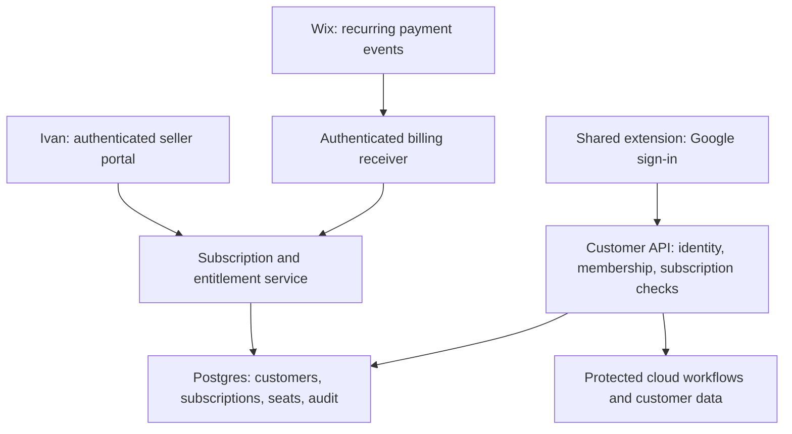

# Commercial licensing and automated renewals

Prepared September 18, 2026. This is a proposed implementation plan based on the local source, not a live deployment security assessment. No passwords, subscriptions, or production settings were changed.

## Recommended business model

Sell a subscription to a customer organization, with named user seats and optional feature packages. Maintain one extension build for all customers. Ivan configures each organization in the seller portal; the backend controls its dates, purchased seats, and enabled features. Customers install the extension and sign in with their approved Google accounts. Branding and configuration load automatically.

Keep the existing Node backend, Postgres database, Google sign-in, customer configuration UI, and membership controls. Add a subscription service shared by manual administration and future payment integrations. Start with the local seller application and manual payments; host an authenticated seller portal later if remote administration becomes useful. The public billing receiver must run on hosted infrastructure independently of Ivan's computer.



## What already exists

| Area | Observed implementation | Required addition |
| --- | --- | --- |
| Seller configuration | `server/customer_setup_web.js` binds to loopback and checks host, origin, and CSRF tokens | Authenticate Ivan; derive audit identity from his authenticated session |
| Customer creation/editing | Transactional provisioning, configuration versions, and audit records | Subscription fields and audited subscription actions |
| User identity | `server/google_identity.js` validates Google tokens, OAuth audience, and verified email | Retain this; keep seller accounts separate from customer roles |
| Customer isolation | Repository scopes membership and data operations by verified identity | Apply the same scope to billing and new server workflows |
| Seat limits | Total and per-role caps; transactional membership changes; last-admin protection | Connect the effective limits to the purchased subscription |
| Access refresh | Bootstrap profiles currently expire after ten minutes | Check subscription on every protected API request; cap profile expiry at entitlement expiry |
| Renewals | No subscription tables, paid-through checks, or billing handlers found in reviewed source | Add the shared subscription service and billing adapter |
| Distribution | One runtime-configurable extension; no release build script in `package.json` | Build an explicit allowlisted release package |

The current setup form's operator-email field is a supplied label, not proof of who made the change. CSRF protection does not replace login. Local-only access is useful protection but does not authenticate other users/processes on the computer.

## Seller workflow

1. Ivan signs in to the seller application.
2. He creates a customer with its existing branding, destinations, and initial administrator.
3. He chooses a package, a start date, monthly or yearly billing, total seats, and any per-role caps.
4. He records the initial payment or explicitly grants a trial/complimentary period. Selecting “monthly” alone must not imply payment or renew access forever.
5. The preview shows the exact access start, paid-through timestamp, next renewal, and available seats.
6. Saving creates the customer, subscription, initial administrator, and audit record atomically, or completes an explicit pending setup transaction before activation.
7. The customer receives an installation link and onboarding instructions. Each user signs in individually; customer administrators manage users within purchased limits.
8. Ivan can renew manually, schedule a package change, cancel renewal, or suspend service. Every change records the actor, reason, before/after state, and payment reference where applicable.

Use named users as the first pricing model. One approved person consumes one seat, regardless of installation count. If computers or simultaneous sessions should be limited too, add device/session registrations as a separate rule. A user cap does not prevent account sharing or count computers.

Customer administrators can manage their users, but cannot change paid dates, purchased capacity, billing mappings, or Ivan's access. Keeping the seller role outside customer memberships also avoids consuming a customer seat for Ivan.

## Password and administration protection

Implement a seller login that protects every customer-list, detail, review, create, update, and subscription route. Keep the existing loopback binding for the first version. The production portal should use HTTPS and a maintained authentication implementation with MFA or passkeys. A managed seller identity is also suitable; restrict access to explicitly authorized operator identities.

If using a password, store a salted Argon2id hash, enforce login throttling, rotate the session on login, expire idle sessions, and provide logout and recovery. Use HttpOnly and SameSite cookies, with Secure cookies on HTTPS, while retaining CSRF protection. Never ship a reusable password in source code or extension files. These password-storage choices follow [OWASP's password-storage guidance](https://cheatsheetseries.owasp.org/cheatsheets/Password_Storage_Cheat_Sheet.html).

The password supplied in the conversation should only be considered for temporary local setup, with a required replacement before production. It is intentionally not reproduced in this document or installed by this planning task. Do not implement a built-in fallback password. Missing authentication configuration must prevent the admin application from opening.

Use separate credentials for seller login, database access, and billing automation. Customers continue using their own Google identities. Billing automation never receives Ivan's login password. Store backend secrets in the deployment secret store; use separate, least-privilege database roles for runtime, administration, and migrations. A database password alone does not protect the seller's web page.

## Subscription data model

Keep the commercial record separate from the branding configuration. For the initial product, allow one current subscription per customer, with history retained.

| Record | Suggested fields and purpose |
| --- | --- |
| `plans` | Immutable/versioned package key, enabled features, default total and per-role seats, provider product/plan mapping |
| `customer_subscriptions` | Customer ID, package version, billing source (`manual` or provider), interval (`month` or `year`), start time, current paid period, `paid_through`, cancellation-at-period-end flag, billing status, revision |
| `customer_entitlements` | Current effective seats/features, validity boundary, revision; transactionally maintained projection used by access checks |
| `billing_events` | Provider, site/account scope, unique event ID, provider subscription/order ID, event time, safe payload/hash, processing status, attempts, error |
| `subscription_audit` | Authenticated operator or provider event, customer, old/new dates and caps, reason, time |
| `entitlement_overrides` | Optional explicit, expiring manual concessions; actor and reason; no invisible edits to provider-owned dates |

Retain `customers.active` as Ivan's administrative suspension switch. A successful renewal must never undo a deliberate suspension. Keep billing status distinct from effective access: a canceled renewal can still have paid time remaining.

Use foreign keys, unique provider subscription mappings, positive seat constraints, and timezone-aware timestamps. Include the provider site/account in mappings and event deduplication. A webhook-supplied customer ID or email must never choose the tenant without a trusted mapping.

Choose one authority for effective caps. For a minimal migration, the subscription service can update the existing validated `config.access` caps as a transactional projection and increment `configVersion`. All commercial cap edits then go through that service; the configuration UI cannot independently overwrite subscription-managed values. Later, authorization can read a dedicated entitlement projection directly.

## Access dates, expiry, and seats

An ordinary paid operation is allowed only when all of these hold:

```text
Google identity is valid
AND customer is administratively enabled
AND user has an active membership and the required permission
AND server time is at or after the access start
AND server time is before the effective entitlement end
AND the requested feature is included
```

Use server time as authority and an exclusive end timestamp. Show the timezone in Ivan's form and convert to UTC in storage. For manual billing, calculate calendar months/years with a documented end-of-month rule; do not treat all months as 30 days. For provider billing, use the verified provider period rather than calculating a new one from webhook arrival time.

Check entitlement on bootstrap, membership operations, statistics, event writes, and each new protected server workflow. Centralize the check and recheck inside sensitive write transactions to prevent renewal/suspension races. Expiration must work even when the scheduler is unavailable.

For the standard client, return:

```text
profile.expiresAt = min(serverNow + 10 minutes, effectiveEntitlementEnd)
```

An unexpired cached profile can cover a short connectivity interruption. Once expired, paid actions stop. Server actions reject suspension immediately on their next authorization check; already issued client profiles can remain usable locally until expiry. If subscription status or seat information is added to the profile, version the protocol and coordinate updates to `utils/access_control.js` and the bootstrap service: the current contract rejects unknown fields.

On renewal, set the authoritative new paid-through date and purchased seat count. Do not increment seats on each renewal. Example: a five-seat monthly package renews for another period with five seats; a paid upgrade changes it to ten seats.

Apply paid upgrades promptly. Schedule reductions for the next period and require the customer administrator to select which users retain seats beforehand. If unresolved at the effective time, enter a clearly defined restricted state that allows an authorized administrator to disable excess users and resolve billing but blocks ordinary paid work. Do not accidentally lock out the only administrator. Current configuration editing rejects caps below active utilization, so a planned downgrade needs a dedicated transition workflow.

Default to no payment-failure grace period for the initial release; make any later grace explicit and bounded. Cancellation of auto-renewal preserves already paid access. Refunds, chargebacks, and immediate termination use an explicit business policy and audited action; they must not silently delete customer data.

## Automated renewal interface

Implement a provider-neutral internal service such as `applySubscriptionChange()`. Ivan's authenticated renewal action and a verified payment adapter both invoke it. Keep provider parsing out of customer API handlers.

The service accepts a trusted customer mapping, expected revision, absolute effective dates, purchased plan/quantity, source reference, and an idempotency key. It validates the policy, locks the subscription/customer rows, applies entitlement and configuration changes, and writes the audit record in one transaction. Repeated or older events must not double-extend time, duplicate seats, or overwrite newer state.

Proposed external integration route: `POST /api/v1/billing/wix`. It accepts verified provider events, not arbitrary public “extend customer” requests. Do not expose a renewal URL authenticated by a shared secret in its query string.

Processing sequence:

1. Verify the event signature and supported algorithm before trusting its payload, and validate the expected site/app/account context.
2. Persist the unique event durably before acknowledging it; reject malformed/untrusted traffic. Return a success acknowledgment for already accepted duplicates.
3. A worker resolves the trusted order-to-customer mapping and retrieves authoritative order/payment details as needed.
4. Confirm actual paid coverage and the purchased package or quantity. A checkout redirect, an order creation, or a cycle-start notification alone is insufficient evidence of settlement.
5. Apply an absolute state transition through the shared service. Protect against concurrent and out-of-order events using provider revisions when available, current provider state, and local transaction/version checks.
6. Retry transient failures with backoff; expose persistent failures for Ivan to resolve. Unknown mappings go to a pending queue and grant no access.
7. Reconcile active subscriptions with the provider periodically to recover missed events. Add renewal reminders separately if desired; a scheduler never manufactures payment.

Postgres can hold the durable inbox and processing queue initially, avoiding another infrastructure service. A hosted scheduled worker processes pending rows. Deduplication belongs in a database unique constraint, not only an in-memory cache.

## Wix connection

Wix exposes Pricing Plans order-cycle events and broader order-update events. Order updates include purchase, lifecycle, pause/resume, and cancellation changes. These can initiate synchronization; confirm the selected Wix API's exact payment fields and event coverage during implementation. See [Order Cycle Started](https://dev.wix.com/docs/api-reference/business-solutions/pricing-plans/orders/order-cycle-started) and [Order Updated](https://dev.wix.com/docs/api-reference/business-solutions/pricing-plans/orders/order-updated?apiView=SDK).

For a single Wix site, a Velo backend event handler can forward an authenticated message to the hosted billing receiver. Sign that server-to-server message with a separate secret, timestamp, and unique event ID; verify it at the receiver. Native self-hosted Wix app webhooks instead arrive as signed JWTs and should be verified using Wix's configured public key. These are separate authentication approaches; do not assume a generic Wix automation POST is inherently signed. References: [Velo cycle event](https://dev.wix.com/docs/velo/apis/wix-pricing-plans-backend/events/on-order-cycle-started) and [Wix webhook verification](https://dev.wix.com/docs/build-apps/develop-your-app/develop-a-self-managed-app/webhooks/handle-events-with-webhooks-for-self-hosting-without-the-java-script-sdk).

Start with fixed packages such as five seats monthly and five seats yearly. Map verified Wix plan IDs to internal packages. Arbitrary per-seat quantities, prorated upgrades, and seat add-ons require checking the chosen checkout/payment product's capabilities; they should not be promised merely because recurring plans exist.

Persist the Wix order/subscription mapping during purchase/onboarding. The payer may be different from the customer's extension administrator; do not use matching email as the sole link. New buyers can remain “paid, awaiting configuration” until Ivan supplies their operational settings. Later onboarding can automate those fields too.

## Protecting the commercial value

Extension JavaScript and local storage are controlled by the user. Obfuscation, a hidden expiration field, a signed profile, extension IDs, and CORS cannot make locally executable code impossible to copy or modify. Signed profiles can detect profile tampering in the standard client, but a modified client can skip the check. Every server operation must authorize independently.

The existing `utils/google_api.js` and reporting workflows call Google APIs directly from the extension. A modified copy could retain those local/direct-Google capabilities after removing local checks. The cloud statistics/membership services remain protectable, but that alone does not fully protect local reporting features.

For stronger licensing, move a valuable paid workflow to the backend, such as final report assembly, managed evidence processing, or shared reporting/analytics. Keep browser page interaction and capture in the extension. Require entitlement for the real server operation, not merely for a token that unlocks a complete local implementation. If Google access moves server-side, separately design consent, minimal scopes, encryption, and token revocation. Retain customers' access to their own existing documents after subscription expiry.

## Release and operational work

- Produce a clean extension ZIP from an explicit file allowlist. Never package the repository root: it contains server code and local environment files. Exclude `.env*`, `.git`, `.neon`, operator tools, migrations, tests, and customer-specific development artifacts. Inspect the final archive and scan it for secrets.
- Prefer one unlisted Chrome Web Store release and send customers its link. Unlisted installation is available to anyone with the link, so backend licensing still controls use. Chrome supports self-hosted Windows/macOS installation through enterprise policies; unpacked development installs are not the normal commercial distribution path. See [distribution options](https://developer.chrome.com/docs/extensions/how-to/distribute) and [unlisted visibility](https://developer.chrome.com/docs/webstore/cws-dashboard-distribution).
- Review `<all_urls>` and Google scopes in `manifest.json`. Test whether the reporting workflow can use narrower grants, including `drive.file` with explicit file selection. Full Drive access has additional verification implications; scope reductions need workflow changes, not just a manifest edit. See [Google Drive scope guidance](https://developers.google.com/workspace/drive/api/guides/api-specific-auth).
- Add bounded request sizes, API/login rate limits, secret-safe logging, failure alerts, and limits for expensive paid operations. Seat limits alone do not control API or storage cost.
- Separate development and production credentials/data; test migrations in isolation. Establish database backup retention and perform a restore test. Monitor subscription processing and API availability.
- Define a customer data retention/export process. Billing failures should stop paid work without destroying customer records.

## Implementation order and acceptance criteria

| Stage | Primary changes | Acceptance criteria |
| --- | --- | --- |
| 1. Protect seller access | Auth module; setup UI/server and launcher; session-derived audit actor | Unauthenticated requests cannot read or mutate customer records; login throttling, CSRF, logout, and session expiry tested |
| 2. Manual subscriptions | New SQL migration; subscription service; seller package/date/renewal fields | Future start blocks access; monthly/yearly renewals and manual overrides are auditable and idempotent; existing customers have explicit migrated terms |
| 3. Enforce paid access | Repository/service authorization; bounded profile lifetime; entitlement projection | Expired/suspended users cannot bypass checks by calling endpoints directly; concurrent seat activation cannot exceed caps; customer admins cannot renew themselves |
| 4. Commercial release | Clean package build; permission/OAuth review; protected cloud workflow | ZIP contains no secrets/operator files; two-customer isolation tests pass; documented limits of local-code protection; installation/update path verified |
| 5. Billing automation | Wix adapter; durable event inbox; worker/reconciliation; trusted order mapping | Duplicate, forged, delayed, reordered, failed-payment, cancellation, upgrade, downgrade, and crash/retry scenarios tested against the chosen payment integration |

Stages 1–4 support manually sold subscriptions. Stage 5 replaces manual renewal entry without replacing the extension or customer database. Automatic reminders, a more elaborate seller dashboard, and device limits can follow once sales justify them.

Existing customers need explicit plan/date assignments during rollout; do not turn missing subscription data into unlimited access. Prepare and review the migration, then enable enforcement after valid records exist. Use targeted integration tests for authorization, time boundaries, concurrent writes, and billing replay behavior before deployment.
